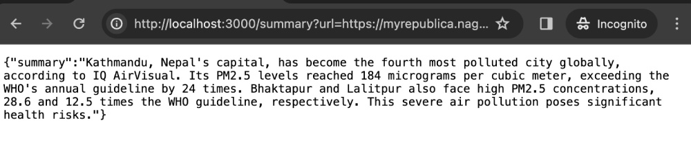

# summarizer-gemini

An example repository to use Google Gemini API to summarize text. Google Cloud credits are provided for this project, thanks GCP :).

## How to use

There are two ways to run this demo app, one as a CLI to quickly test and another one as an API.

### Use it as a CLI script to test out

To use this sumamrizer (only avaiable in the command line for now), do the following:

1. Clone the repository with `git clone git@github.com:geshan/summarizer-gemini.git`
2. Go to the directory with `cd summarizer-gemini` the run `npm install`
3. Log in to your GCP Console with `gcloud auth application-default login`
4. Make sure your Vertext API is enabled in the project you want to use it. You can try this URL to play around: https://console.cloud.google.com/vertex-ai/generative/language/create/text
5. After that run `GCP_PROJECT=<your-project-id> GCP_LOCATION=<gcp-location> node --no-warnings cli.js <your-url>` as an example `GCP_PROJECT=gemini-try-414805 GCP_LOCATION=us-central1 node --no-warnings cli.js https://jobs.lever.co/tyro/48a12893-c1a2-4a42-afa4-bc7fb6f572e5`
6. It will print out a summary on the CLI if everything went fine, like below:

### Use it as an API

To use the summarize as an API, you can do the following after doing steps 1-4 in the above section:

1. Run `GCP_PROJECT=<your-project-id> GCP_LOCATION=<gcp-location> npm start` where the project id and location is needed as the above example.
2. On your browser of choice hit `http://localhost:3000/summary?url=https://myrepublica.nagariknetwork.com/news/kathmandu-ranks-fourth-among-world-s-most-polluted-cities/` you should get a summary as follows:

