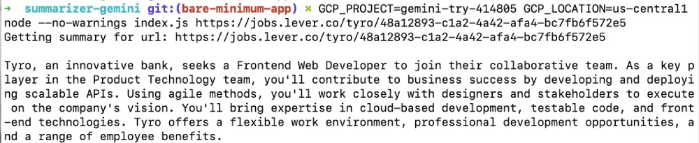

# summarizer-gemini

An example repository to use Google Gemini API to summarize text

## How to use

To use this sumamrizer (only avaiable in the command line for now), do the following:

1. Clone the repository with `git clone git@github.com:geshan/summarizer-gemini.git`
2. Go to the directory with `cd summarizer-gemini` the run `npm install`
3. Login to your GCP Console with `gcloud auth application-default login`
4. Make sure your Vertext API is enabled in the project you want to use it. You can try this URL to play around: https://console.cloud.google.com/vertex-ai/generative/language/create/text
5. After that run `GCP_PROJECT=<your-project-id> GCP_LOCATION=<gcp-location> node --no-warnings index.js <your-url>` as an example `GCP_PROJECT=gemini-try-414805 GCP_LOCATION=us-central1 node --no-warnings index.js https://jobs.lever.co/tyro/48a12893-c1a2-4a42-afa4-bc7fb6f572e5`
6. It will print out a summary on the CLI if everything went fine, like below:

## Further steps

As the scraper and summarizer (using Gemini-pro) is working, it will be easy to add on Express and build a API that can take in text (in POST) and send back the summary. It can be used for other things too. This is like a working proof of concept.
